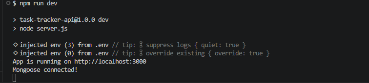
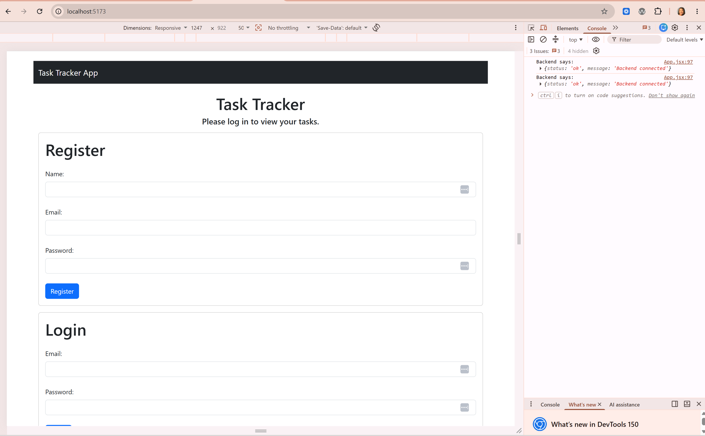

# Task Tracker App

A secure, full‑stack app with REST API and React frontend for creating, updating, retrieving, and deleting personal tasks. Built with React, Bootstrap, Node.js, Express, MongoDB, and JWT authentication, this app allows each user to manage their own tasks safely and privately.

## Project Overview

The Task Tracker provides user authentication and protected CRUD operations for managing tasks in a responsive and well-designed app. Each user can register, log in, and perform task operations that are securely scoped to their own account. This app is designed for learning how to build full‑stack applications.

## Features

- User Registration & Login with hashed passwords

- JWT Authentication with protected routes

- Create / Read / Update / Delete Tasks

- User‑scoped data (users can only access their own tasks)

- Auto‑incrementing taskId for easy referencing

- Input validation for required fields

- Clear error handling for all routes

## Technologies Used

- React.js

- Bootstrap.css

- Node.js

- Express.js

- MongoDB + Mongoose

- bcryptjs for password hashing

- jsonwebtoken (JWT) for authentication

- dotenv for environment variable management

## Local Setup Instructions

1. Fork the repository - click the fork icon to the right and create a fork of the project in your own account

2. Clone the repository - in your own repository of the forked code, click the green "Code" button and copy the HTTP URL. Then in a terminal on your local machine, navigate to the folder where you'd like to keep your local repository files. Type this into your terminal:

bash

```
git clone your_repo_url_here
cd task-tracker-final
```

3. Install dependencies for the backend

bash

```
cd backend
npm install
npm install express dotenv bcryptjs jsonwebtoken
npm install --save-dev nodemon
npm install cors
```

4. Install dependencies for the frontend

bash

```
cd ../frontend
npm install
npm install react-bootstrap bootstrap
```

5. Create two .env files, one in the frontend and one in the backend.
   Add the required environment variables (see next section).

6. Start the server in the backend

bash

```
cd ../backend
npm run dev
```

7. Start the project in the frontend in a separate terminal

bash

```
cd ../frontend
npm run dev
```

The API will run on the port you specify in your .env.

## Required Environment Variables

Create a .env file in the backend folder with the following keys:

```
PORT=your_port_number
MONGO_URI=your_mongodb_connection_string
JWT_SECRET=your_jwt_secret
```

Create a .env file in the frontend folder with the following key:

```
VITE_API_URL=your_local_host_backend_url
```

**Do NOT include your actual values in the README or commit them to GitHub.**

## API Routes Overview

### Health Route

#### Method Endpoint Description

- GET /api/health ~ Confirms API is running

### Auth Routes

#### Method Endpoint Description

- POST /api/auth/register ~ Register a new user
- POST /api/auth/login ~ Log in and receive a JWT

### Task Routes (Protected)

All task routes require a valid Authorization: Bearer <token> header.

#### Method Endpoint Description

- POST /api/protected/tasks ~ Create a new task
- GET /api/protected/tasks ~ Get all tasks for the logged‑in user
- GET /api/protected/tasks/:taskId ~ Get a single task by taskId
- PATCH /api/protected/tasks/:taskId ~ Update a task
- DELETE /api/protected/tasks/:taskId ~ Delete a task

## Testing Notes

- Run the frontend from the "frontend" folder and the backend from the "backend" folder in separate terminals, running the backend first

- Use "npm run dev" in each folders' terminals

bash

```
npm run dev
```

- Ensure your MongoDB instance is running before testing

## Screenshots

Backend running locally:



Frontend running locally:


## Known Issues / Future Improvements

### Known Issues

- useEffect in App.jsx is flagging because using a synchronous function in a useEffect might create cascading re-renders, however, the app is working properly

- backEndError is also flagging because the variable is assigned in the useState, but never used, which does not hinder functionality

### Future Improvements

- Add pagination for large task lists

- Add bulk create tasks route

- Add user profile routes

- Add soft‑delete or archive functionality

- Add rate limiting for security

- Add request validation middleware (Joi / Zod)

- Add Swagger/OpenAPI documentation
